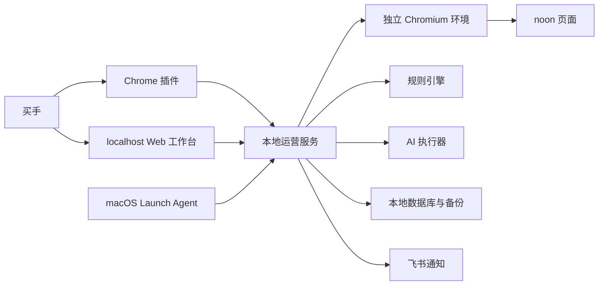

# Noon 选品运营助手 PRD v1.0

## 1. 文档信息

- 产品名称：Noon 选品运营助手
- 文档版本：v1.0
- 文档日期：2026-07-26
- 第一阶段形态：macOS 本地服务 + localhost Web 工作台 + Chrome 插件 + 飞书通知
- 第一阶段用户：单用户买手
- 第一阶段来源平台：noon

## 2. 产品摘要

Noon 选品运营助手是一套面向买手的持续选品决策支持系统。它每天从用户配置的 noon 类目和人工补充商品中采集页面可见数据，形成历史快照；每周按透明规则输出“成熟热品”和“上升新品”候选，并说明推荐理由，帮助买手缩小需要人工判断的商品范围。

现有 Chrome 插件不再是产品本体，而是运营助手的页面核验和所见即所得采集入口。localhost Web 工作台持有配置、商品、推荐、复核状态、日志和备份；飞书负责主动通知；最终是否进入采购评估仍由买手决定。

第一阶段不自动采购、上架、定价、投放或管理库存，也不把 Ratings 描述成真实销量。

## 3. 背景与问题

当前选品主要依赖买手在 noon 类目页中逐页浏览，通常查看约 10 页，再根据 Ratings、评分、价格、商品形态和经验判断哪些商品值得继续评估。这种方式存在以下问题：

- 浏览范围和判断过程依赖人工记忆，难以稳定重复。
- 单次页面只能看到当前状态，无法识别热度变化趋势。
- Ratings 可以反映热度，但不是实际销量，容易在转述时失真。
- 电动、大件等不符合偏好的商品需要反复人工排除。
- 每周推荐、人工复核和后续变化缺少统一的状态与日志。
- 买手在日常浏览中发现的商品，缺少快速加入持续观察的入口。
- 现有插件只分析当前页面，不能承担定时采集、历史沉淀和运营闭环。

## 4. 产品目标

### 4.1 第一阶段目标

- 让买手在 Web 工作台中自行配置需要持续观察的 noon 类目。
- 每日自动形成可追溯的商品快照，支持绝对热度和趋势判断。
- 每周按类目输出少而可信的成熟热品、上升新品及推荐理由。
- 将人工浏览时看到的商品快速同步到统一评估池并持续跟踪。
- 让每个推荐、复核状态、自动变化和通知都有完整审计日志。
- 通过飞书及时告知日常采集结果、周度推荐和需要人工处理的故障。
- 用首 4 个完整周建立真实推荐质量基线和 Bad Case 集。

### 4.2 中长期目标

- 把同一套能力部署为正式在线服务，支持多用户、权限和远程协作。
- 通过独立平台适配器扩展到 noon 之外的来源平台。
- 在产品需要分发给更多本地用户时，再评估轻量 Mac 客户端外壳。

## 5. 非目标

第一阶段明确不包含：

- 自动决定是否采购、采购数量或利润空间。
- 自动下单、上架、改价、广告投放或库存操作。
- 扫描完整 Toys 大类或自动发现所有潜在类目。
- 将 Ratings、评论数或推荐排序伪装成真实销量。
- 绕过登录、验证码、403、429 或其他访问控制。
- 使用隐身插件、指纹伪装、代理轮换或验证码破解。
- 从飞书反向访问 localhost 或在飞书中直接修改复核状态。
- 把 localhost 通过端口映射或隧道暴露到公网。
- 第一阶段建设原生 Mac 客户端、多用户账号或云端同步。
- 仅凭 AI 黑盒评分决定正式推荐。

## 6. 用户与职责

### 6.1 买手

第一阶段唯一人工用户，负责：

- 配置类目观察范围和推荐规则。
- 查看周度推荐及其证据。
- 将推荐实例标记为接受、观察或排除。
- 对大小、带电等证据不足的商品作人工确认。
- 处理采集拦截、平台页面变化或本地运行异常。
- 决定商品是否进入后续采购评估。

### 6.2 系统

系统负责：

- 按计划采集并保存商品快照。
- 去重、合并商品身份和记录来源。
- 执行硬门槛、推荐规则和数据完整性检查。
- 在必要时调用 AI 解释非结构化属性。
- 生成周度推荐、数据不足说明和飞书消息。
- 按规则自动转换逾期待复核状态。
- 记录人工与自动操作日志。

系统不替买手作采购决策。

## 7. 已实现基线与待建设范围

### 7.1 已实现：Chrome 插件 v0.1.11

现有仓库已经具备以下页面内能力：

- 在 noon 页面读取当前已渲染商品。
- 解析商品名称、链接、价格、Ratings、评分和可见销量信号。
- 按热度、销量信号、价格、评分或页面顺序排序。
- 对重复商品和非商品卡片进行过滤。
- 跟随 noon 站内跳转和异步 DOM 更新刷新。
- 在当前页定位并高亮商品。
- 复制结果和导出 CSV。
- 本地规则建议和长期解析评测集。

这些能力是新产品可复用的解析与页面核验基础，但尚不等于运营助手已经实现。

### 7.2 第一阶段待建设

- 本地 Node.js 运营服务。
- localhost Web 工作台和首次设置流程。
- 独立 Chromium 采集环境。
- 类目观察池和单品观察池。
- 每日采集、补采和周度推荐调度。
- 本地数据库、历史快照、日志和备份恢复。
- 推荐规则、复核状态和数据不足报告。
- Claude Code CLI、Codex CLI AI 执行器适配。
- 飞书通知。
- 插件与工作台之间的单品和当前页批量同步。

## 8. 产品形态与总体架构

### 8.1 本地运营服务

- 使用现有 Node.js 技术基础承载 API、调度、采集、规则、AI 调用、通知和数据存储。
- 仅绑定本机回环地址，不接受公网入站请求。
- 由当前用户的 macOS Launch Agent 在登录后启动。
- 电脑关机或休眠时不采集；恢复后按补采规则执行一次。
- 第一阶段不建设原生 Mac 客户端；产品界面继续使用 localhost Web 工作台。

### 8.2 Web 工作台

Web 工作台是产品主界面和唯一状态主数据入口，包含：

1. 今日概览
2. 类目观察
3. 单品观察
4. 候选评估
5. 周度报告
6. 操作日志
7. 系统设置

### 8.3 独立浏览器环境

- 采集使用独立 Chromium 数据目录，不复用日常 Chrome 个人资料。
- noon 当前无需登录即可浏览目标内容，因此默认使用访客状态。
- 独立环境可以保留普通 Cookie、地区和页面偏好，但不托管账号密码。
- 如果未来页面必须登录，工作台提供“打开浏览器处理”入口，由用户在可见窗口中手动完成。
- 浏览器窗口是否显示只作为运行和排障设置，不作为规避平台检测的策略。

### 8.4 Chrome 插件

插件承担两个职责：

- 页面核验：在 noon 原页面定位和查看商品上下文。
- 所见即所得采集：把当前看到的单个或一页商品同步到工作台。

插件不持有类目配置、历史快照、推荐状态或操作日志。

### 8.5 飞书

飞书是第一阶段的主动通知触点，不是数据中心：

- 系统可以向飞书发送摘要、周报、故障和恢复通知。
- 飞书不回调 localhost。
- 用户在 localhost Web 工作台完成复核。

## 9. 核心业务流程

### 9.1 首次设置

用户第一次打开工作台时必须完成设置向导：

1. 设置本地用户名称。
2. 确认时区。
3. 设置每日采集时间。
4. 设置每周推荐日期和时间。
5. 配置并测试飞书通知。
6. 检查 AI 执行器状态和默认顺序。
7. 添加当前明确的两个类目 URL，并确认自动识别的名称。
8. 确认默认采集深度和推荐规则。

在设置向导完成前，不自动创建采集任务。

### 9.2 每日采集

1. 调度器在全局配置时间触发。
2. 系统依次处理已启用类目观察项和单品观察项。
3. 类目页使用 noon 原生 `Sort by: Recommended`。
4. 每个类目默认读取 10 页，按类目配置可减少或增加。
5. 系统使用正常浏览器渲染、单一受控会话、低并发和保守节奏采集。
6. 页面数据经字段校验、商品识别和去重后写入商品快照。
7. 新商品、关键证据变化或待确认商品进入属性判断。
8. 任务结束后生成一条合并的日常采集摘要并发送飞书。

### 9.3 开机或恢复补采

- 如果计划执行时电脑关机、休眠或本地服务未运行，下次启动时执行一次补采。
- 补采使用真实执行时间。
- 不为每个错过日期重放任务，也不伪造历史快照。
- 同一个计划窗口只补采一次。

### 9.4 周度推荐

1. 到达周度计划时间时，系统关闭上一批次的待复核状态。
2. 上一批次仍为待复核的推荐实例自动转为观察，并记录系统操作日志。
3. 系统按类目检查数据新鲜度和覆盖度。
4. 对达标类目分别计算成熟热品和上升新品。
5. 对不达标类目不生成正式候选，但仍生成数据不足说明。
6. 系统生成独立的人工补充分组。
7. 每个推荐实例生成简短、结构化、可追溯的推荐理由。
8. 周报写入本地数据库并发送飞书。
9. 所有新推荐实例默认进入待复核。

用户也可以手动触发刷新，但手动刷新同样遵守数据门槛、审计和批次规则。

### 9.5 人工复核

每个推荐实例支持：

- 待复核：默认状态。
- 接受：值得进入采购评估，不代表已经采购。
- 观察：暂不接受或排除，继续保留。
- 排除：否定本次推荐，不永久封禁商品。

状态规则：

- 待复核满 7 天自动转为观察。
- 如果下一轮周度推荐先发布，则上一轮待复核在发布时自动转为观察。
- 两个条件以先发生者为准。
- 人工和系统状态变化都必须记录变化前后状态、时间、原因和操作者。
- 商品以后出现新的有效证据时可以再次推荐；新推荐必须说明相较上次发生了什么变化。

### 9.6 人工补充

插件提供两种同步方式：

- 单品补充：选择当前可见的一个商品并同步。
- 当前页批量补充：先展示有效商品数、重复情况和预览，用户确认后同步。

同步规则：

- 第一阶段只支持 noon 页面，但不限制商品必须属于已配置类目。
- 同一 noon 商品合并到一个稳定商品身份。
- 重复补充只新增来源记录、快照和日志，不复制商品，也不覆盖当前复核状态。
- 人工补充商品默认进入候选评估池的“人工补充”分组并处于待复核状态。
- 人工补充商品自动成为单品观察项，持续参加每日采集，直到用户明确停止。
- 跟踪状态与复核状态相互独立。
- 只有后续证据满足成熟热品或上升新品规则时，商品才进入对应正式推荐，并产生新的推荐实例。

## 10. 功能需求

### 10.1 今日概览

显示：

- 本地服务、调度器、浏览器环境、飞书和 AI 执行器状态。
- 最近一次采集时间、结果、耗时和商品数量。
- 下一次每日采集和周度推荐时间。
- 待复核数量、即将自动转观察数量。
- 连续失败和需要人工处理的类目。
- 最近一份周报入口。

提供：

- 手动采集。
- 手动生成周度推荐。
- 打开独立浏览器处理页面问题。
- 进入失败日志和候选评估池。

### 10.2 类目观察

用户可以：

- 粘贴 noon 类目 URL 新增观察项。
- 由系统自动识别类目名称；识别失败时手工填写。
- 查看启用状态、采集深度、最近结果和连续失败次数。
- 调整每个类目的采集深度，默认 10 页。
- 覆盖该类目的推荐规则和数据门槛。
- 停用并保留全部历史。
- 恢复已停用类目。
- 永久删除类目及其历史；该动作必须独立入口、说明影响并二次确认。

系统不把初始两个类目名称写死在代码中。

### 10.3 单品观察

用户可以：

- 查看人工补充产生的所有单品观察项。
- 查看商品来源、补充时间、最近快照和当前跟踪状态。
- 停止或恢复单品跟踪。
- 进入商品详情查看全部快照、推荐和操作记录。

### 10.4 候选评估

支持按以下维度筛选：

- 推荐批次。
- 类目。
- 成熟热品、上升新品、人工补充或待确认。
- 待复核、接受、观察或排除。
- 人工状态变化或系统自动变化。

每张候选卡至少展示：

- 商品名称、图片、noon 链接和来源类目。
- 推荐类型。
- 当前热度信号及来源。
- 价格、评分和可见销量信号。
- 7 日趋势摘要。
- 硬门槛判断和待确认属性。
- 结构化推荐理由。
- 当前复核状态和状态历史。
- 页面核验入口。

### 10.5 周度报告

报告按类目展示：

1. 类目数据状态和覆盖范围。
2. 成熟热品，最多 10 个。
3. 上升新品，最多 10 个。
4. 该类目的待确认商品摘要。

另外提供全局“人工补充”分组。

候选不足时不补位，可以为零。

类目数据不达标时：

- 该类目仍保留在周报中。
- 不生成对应正式候选。
- 必须说明失败或缺失原因。
- 必须说明缺失日期、页数或影响范围。
- 必须说明对成熟热品或上升新品判断的影响。
- 必须说明系统已采取的动作和建议人工处理方式。
- 不复用旧候选冒充本周结果。
- 不阻塞其他达标类目的报告。

### 10.6 操作日志

日志采用只追加、不覆盖的记录方式，至少覆盖：

- 类目新增、修改、停用、恢复和永久删除。
- 采集开始、完成、失败、补采和恢复。
- 商品创建、去重合并和人工补充。
- 推荐生成和重复推荐。
- 人工与系统状态变化。
- AI 执行器调用、重试、降级和失败。
- 飞书发送尝试、结果和错误。
- 备份、导出和恢复。

每条日志至少包含：

- 对象类型和对象 ID。
- 所属批次或任务。
- 操作时间。
- 操作者：本地用户或系统。
- 操作类型。
- 变化前值和变化后值。
- 触发原因。
- 执行结果。

### 10.7 系统设置

设置页至少包含：

- 本地用户名。
- 时区。
- 全局每日采集时间。
- 全局周度推荐日期和时间。
- 飞书通知配置与测试。
- AI 执行器启停和优先顺序。
- 默认采集深度。
- 默认推荐规则和类目覆盖入口。
- 数据达标门槛。
- 独立浏览器状态和人工处理入口。
- 手工导出、备份和恢复。

## 11. 数据与采集规则

### 11.1 数据来源

第一阶段只使用 noon 页面正常渲染后可见的商品事实，包括：

- 商品标题、稳定商品链接和图片。
- 当前价格、原价和可见折扣。
- Ratings 数量。
- 评分和评论数。
- 页面可见的 `sold recently` 等销量信号。
- 商品描述、规格和页面标签。
- 页面位置、来源类目、来源 URL 和采集时间。

### 11.2 指标语义

- `sold recently` 等明确销量文本作为可见销量信号保存。
- Ratings 是热度信号，不是真实销量。
- noon 的 `Sort by: Recommended` 是来源平台排序，不是运营助手推荐。
- 缺失字段显示“未识别”或“无数据”，不得估造。

### 11.3 商品身份与去重

- 同一来源平台商品只保留一个商品身份。
- 优先使用稳定 SKU 或规范化商品 URL。
- 标题、价格和图片等信号只用于辅助匹配。
- 多次采集形成多个商品快照。
- 多次人工补充形成多个来源记录。
- 每轮正式推荐形成独立推荐实例。
- 合并操作必须留日志，不能静默覆盖。

### 11.4 数据达标门槛

默认门槛：

- 成熟热品：最新有效快照不超过 48 小时。
- 上升新品：观察窗口完整覆盖最近 7 个自然日，其中至少 5 天存在有效快照，且最新有效快照不超过 48 小时。
- 规则可在设置页调整，也可按类目覆盖。

如果只满足成熟热品门槛，不满足趋势门槛：

- 可以输出成熟热品。
- 上升新品区域标记数据不足并说明原因。

## 12. 推荐规则

### 12.1 原则

- 透明规则拥有正式推荐决策权。
- 推荐使用类目内部相对排名和最低数据要求，不使用未经校准的全局绝对阈值。
- 每个类目、每个推荐类型最多 10 个。
- 不凑数；没有可信候选时输出零个。
- 推荐分数、排序过程和最终理由必须可以由已记录数据重现。

### 12.2 硬门槛

- 明确为电动商品：排除正式推荐。
- 明确有大型商品证据：排除正式推荐。
- 是否带电或大小证据不足：进入待确认，不进入正式推荐。
- AI 不得覆盖硬门槛。

第一阶段不设置统一尺寸数值，因为不同类目的商品形态不同；使用类目范围、明确页面证据和人工确认共同判断。

### 12.3 成熟热品

成熟热品用于发现当前绝对热度较强的商品，至少考虑：

- 类目内 Ratings 相对排名。
- 页面可见销量信号。
- 评分、价格和页面位置等辅助事实。
- 数据新鲜度。
- 选品硬门槛。

单次高热度可以支持成熟热品，但不能证明商品正在上升。

### 12.4 上升新品

上升新品用于发现最近 7 日热度显著提升的商品，至少考虑：

- 7 日热度变化幅度。
- 有效快照覆盖度。
- 最新数据新鲜度。
- 变化是否来自稳定增长而非单个异常点。
- 当前绝对热度是否达到最低可解释水平。
- 选品硬门槛。

在形成完整 7 日观察窗口前，不输出上升新品，也不使用“疑似上升”等代理结论替代。

### 12.5 推荐理由

推荐理由使用简短结构化卡片，不生成冗长自由文案，至少包含：

- 推荐类型。
- 关键热度、价格、评分或销量信号。
- 观察窗口和趋势。
- 满足的选品条件。
- 数据来源和不确定性。
- 如果曾被推荐，本次相较上次的新变化。

每次推荐都必须有理由；证据不足时不生成正式推荐。

## 13. AI 能力

### 13.1 AI 职责

AI 只用于：

- 从商品标题、描述和规格中判断可能的带电属性。
- 识别明确的大件证据或大小不确定性。
- 归纳商品特征。
- 将规则证据整理为简短推荐说明。

AI 不用于：

- 独立决定商品是否正式推荐。
- 改写硬门槛结果。
- 估造销量、规格或趋势。
- 自动采购或执行外部操作。

### 13.2 执行器顺序

默认顺序：

1. Claude Code CLI
2. Codex CLI
3. 用户以后明确配置并启用的 Platform API

设置页允许启用、停用和调整顺序。

安全要求：

- 应用只调用 CLI 提供的非交互入口。
- CLI 自行管理登录，应用不读取、复制或导出其登录 token。
- 任务使用隔离、只读、临时和结构化输出方式。
- Platform API 未配置时保持禁用，不自动产生付费调用。

### 13.3 调用时机与复用

只在以下情况调用 AI：

- 首次发现商品。
- 标题、规格、描述或关键证据变化。
- 大小或带电属性不确定。
- 之前处于 AI 待处理状态。

证据未变化时复用既有判断，避免每日重复消耗。

### 13.4 失败与降级

- 额度不足、限流、登录失效、超时或服务不可用：尝试下一个已启用执行器。
- 结构化输出错误：原执行器重试一次。
- 业务输入错误：不自动切换执行器，记录问题等待修复。
- 所有执行器不可用：采集继续，商品标记 AI 待处理或待确认。

所有调用、重试、降级和结果写入日志。

## 14. 礼貌采集与拦截处理

### 14.1 采集原则

- 使用正常浏览器渲染页面。
- 单一受控浏览器会话。
- 低并发、保守间隔和有限采集深度。
- 只读取用户配置范围内的数据。
- 不绕过访问控制，不尝试伪装攻击流量。

### 14.2 拦截处理

遇到登录要求、验证码、403、429 或其他访问控制时：

1. 立即停止受影响的类目或单品任务。
2. 不自动重试轰炸页面。
3. 保存时间、URL、任务、错误类型和可用页面证据。
4. 计入该对象连续失败次数。
5. 在日常采集摘要中说明首次失败。
6. 同一对象连续两次计划采集失败时发送独立飞书告警。
7. 等待用户通过正常浏览器处理，或等待平台恢复。
8. 下一次成功时清零连续失败并发送恢复通知。

## 15. 飞书通知

### 15.1 日常采集摘要

每天合并发送一条，包含：

- 各类目成功或失败状态。
- 首次失败但尚未达到告警门槛的对象。
- 每个类目的有效商品数。
- 单品观察成功和失败数量。
- 总耗时。
- 补采标识。
- localhost 工作台入口。

### 15.2 周度推荐

包含：

- 本轮时间和数据覆盖情况。
- 每个类目的成熟热品和上升新品数量。
- 代表性候选与简短理由。
- 数据不足类目的原因和处理建议。
- 人工补充数量。
- 待复核总数。
- 本地完整报告入口。

### 15.3 故障与恢复

独立通知以下事件：

- 同一类目或单品连续两次采集失败。
- 飞书配置失效。
- 本地数据库或备份失败。
- 所有已启用 AI 执行器不可用且出现待处理商品。
- 连续失败对象恢复成功。

通知发送尝试和结果必须写入日志。第一阶段先发送完整运营消息，后续根据真实消息量再决定是否降噪。

## 16. 数据存储、备份与恢复

- 第一阶段使用本机数据库保存商品、快照、推荐、复核状态、配置和日志。
- 每天自动生成恢复备份。
- 保留最近 30 份备份，超出后删除最旧备份。
- 设置页支持手工导出。
- 设置页支持从备份恢复，并在执行前明确说明覆盖范围。
- 备份和恢复都写入操作日志。
- 第一阶段不做云端同步。

## 17. 核心数据模型

### 17.1 实体

| 实体 | 说明 |
|---|---|
| LocalUser | 第一阶段唯一人工操作者 |
| CategoryWatch | 类目 URL、名称、启用状态、采集深度和规则覆盖 |
| Product | 来源平台上的稳定商品身份 |
| ProductWatch | 独立的单品跟踪状态 |
| ProductSnapshot | 某次采集时的页面可见事实 |
| ManualCapture | 插件人工补充产生的来源记录 |
| RecommendationBatch | 一轮周度推荐 |
| Recommendation | 某商品在某批次中的独立推荐实例 |
| ReviewEvent | 人工或系统复核状态变化 |
| CollectionRun | 一次类目、单品或补采任务 |
| NotificationAttempt | 一次飞书发送尝试 |
| AIJudgement | 基于某一证据版本的 AI 属性判断 |
| AuditLog | 不可覆盖的统一操作记录 |

### 17.2 关系

- 一个 CategoryWatch 关联多个 CollectionRun。
- 一个 Product 关联多个 ProductSnapshot。
- 一个 Product 可以来自多个 CategoryWatch 和 ManualCapture。
- 一个 Product 最多对应一个启用中的 ProductWatch。
- 一个 Product 可以在不同批次拥有多个 Recommendation。
- 一个 Recommendation 拥有多个 ReviewEvent，但只有一个当前状态。
- 每个自动或人工动作至少对应一条 AuditLog。

## 18. 成功指标

### 18.1 核心指标

人工有效推荐率：

`（人工标记为接受的推荐数 + 人工标记为观察的推荐数）÷ 人工已复核推荐数`

计算规则：

- 人工已复核包括接受、人工观察和排除。
- 系统自动转观察不进入分子，也不进入分母。
- 指标按周、类目和推荐类型拆分。

### 18.2 基线阶段

- 上线后前 4 个完整周只建立基线，不预设缺少真实依据的百分比目标。
- 同期记录排除原因、待确认原因、重复推荐效果和采集 Bad Case。
- 第 4 个完整周结束后，再根据基线设定正式质量目标。

### 18.3 第一阶段运营指标

- 每日采集计划执行结果可追溯。
- 周度报告按计划产出，失败类目也有明确说明。
- 每个正式推荐都有结构化理由。
- 每次状态变化都有操作者、原因和前后值。
- 自动观察不污染人工有效推荐率。
- 备份连续保留最近 30 份并可恢复。

## 19. 验收标准

### 19.1 首次设置与调度

- 新用户未完成设置向导前不会自动采集。
- 用户可以配置本地名称、时区、每日时间和每周时间。
- 电脑错过计划后，下次启动只执行一次补采。
- 补采不伪造错过日期的快照。

### 19.2 类目与单品配置

- 用户可以通过 noon 类目 URL 新增、停用、恢复类目。
- 类目名称自动识别失败时可以手工填写。
- 默认采集深度为 10 页，且可以按类目调整。
- 永久删除需要二次确认并记录日志。
- 插件可以补充不属于已配置类目的 noon 商品。
- 人工补充商品自动进入单品观察池，且可独立停止或恢复。

### 19.3 采集与数据质量

- 类目采集使用 noon 原生 Recommended 排序。
- Ratings 始终标记为热度信号，不显示为真实销量。
- 同一商品不会因追踪参数或重复卡片产生多个商品身份。
- 页面字段缺失不会导致伪造数据。
- 遇到登录、验证码、403 或 429 时停止对应任务，不绕过。
- 同一对象连续两次失败发送飞书告警，恢复后发送恢复通知。

### 19.4 推荐

- 达标类目可以独立生成成熟热品和上升新品。
- 成熟热品最新快照默认不超过 48 小时。
- 上升新品默认覆盖最近 7 天、至少 5 天有效数据且最新不超过 48 小时。
- 每类目每种正式推荐最多 10 个，不足时不补位。
- 明确电动或明确大型商品不会进入正式推荐。
- 属性证据不足的商品进入待确认。
- 每个推荐都有类型、关键数据、趋势、条件和变化说明。
- 数据不足类目仍出现在报告中并解释原因、影响和动作。

### 19.5 复核与日志

- 新推荐默认为待复核。
- 用户可以标记接受、观察或排除。
- 待复核在满 7 天或下一批次发布时自动转观察，以先发生者为准。
- 人工和系统状态变化均产生不可覆盖日志。
- 排除只作用于本次推荐，商品可因新证据再次推荐。
- 重复推荐必须说明相较上次的变化。

### 19.6 AI

- 默认优先使用 Claude Code CLI，其次 Codex CLI。
- 用户可以启停和调整执行顺序。
- 应用不读取 CLI 登录 token。
- 稳定证据不会每天重复调用 AI。
- 执行器均不可用时采集仍能完成，相关商品进入 AI 待处理。

### 19.7 备份与通知

- 每天生成本地备份并保留最近 30 份。
- 用户可以手工导出和恢复。
- 每天只发送一条合并采集摘要，独立故障告警除外。
- 每周发送推荐报告或数据不足报告。
- 每次通知尝试都有发送结果日志。

## 20. 评测与测试要求

### 20.1 解析评测

- 保留并扩展现有 `evals/evaluation_set.json`。
- 覆盖 noon 列表页、详情页、异步渲染、重复商品、非商品卡片和字段缺失。
- 基础自动化测试和长期解析评测必须全部通过后才能声明相关功能完成。

### 20.2 业务规则测试

- 电动、大件和属性不确定分流。
- 成熟热品和上升新品的数据门槛。
- 7 日窗口中 5 天有效数据的边界。
- 每类目最多 10 个且不补位。
- 重复推荐的变化说明。
- 数据不足类目仍生成报告段落。

### 20.3 流程测试

- 首次设置。
- 正常每日采集和单次补采。
- 手动刷新与计划任务互斥。
- 两次连续失败、飞书告警和恢复通知。
- 新批次发布触发旧待复核自动观察。
- 插件单品补充和当前页批量补充。
- 商品去重与来源合并。
- 备份、导出和恢复。

### 20.4 AI 执行器测试

- Claude Code CLI 成功。
- Claude 不可用后降级到 Codex CLI。
- 结构化输出错误时原执行器重试一次。
- 业务输入错误不错误降级。
- 所有执行器不可用时进入 AI 待处理。
- 证据未变化时复用判断。

## 21. 分阶段交付

### 阶段 0：现有插件基线

- 保持当前页面解析、排序、定位、复制和导出能力。
- 继续维护解析评测集。

### 阶段 1：本地运营闭环

- 本地服务、Web 工作台和首次设置。
- 独立浏览器采集。
- 类目与单品观察池。
- 每日快照、补采和周度推荐。
- 候选复核、日志、飞书和备份。
- 插件同步工作台。
- Claude Code CLI 与 Codex CLI 执行器。

阶段 1 的完成标志不是“页面可打开”，而是两个已配置类目能够连续跑通每日采集、周度报告、人工复核和日志闭环。

### 阶段 1.5：本地产品化触发项

只有出现以下需求时才评估 Mac 客户端外壳：

- 需要交付给多位非技术用户安装。
- 需要菜单栏状态、自动升级和更标准的登录项管理。
- localhost 启停和排障成为主要使用障碍。

客户端只封装现有本地服务和 Web UI，不重写核心业务。

### 阶段 2：正式在线服务

- 托管数据库和任务运行环境。
- 用户账号、组织、角色和权限。
- 受控的飞书双向协作。
- 远程访问和多用户审计。
- 平台适配器扩展。

阶段 2 通过正式部署实现，不暴露个人电脑上的 localhost。

## 22. 风险与控制

| 风险 | 控制方式 |
|---|---|
| noon 页面结构变化 | selector 分层、解析评测、失败证据和插件页面核验 |
| Ratings 被误解为销量 | UI、周报、导出和日志统一标记为热度信号 |
| 采集触发访问限制 | 低并发、保守节奏、有限深度、遇拦截立即停止 |
| 本机休眠导致缺采 | 启动后单次补采，报告显示数据覆盖 |
| AI 输出不稳定 | 透明规则决策、结构化输出、证据版本和人工待确认 |
| CLI 额度或登录失效 | 可配置执行顺序、有限降级、AI 待处理 |
| 推荐数量过多 | 每类目每种最多 10 个且不补位 |
| 自动观察污染效果指标 | 从人工有效推荐率的分子和分母同时排除 |
| 本地数据损坏 | 每日备份 30 份、手工导出和恢复 |
| 单用户产品未来难迁移 | 核心数据模型保留操作者和审计字段，在线阶段再增加权限 |

## 23. 产品原则

- 先组合现有插件解析能力，跑通最小运营闭环。
- 每日采集、周度推荐、人工复核、日志和 Bad Case 必须形成可持续循环。
- 推荐宁缺毋滥，不用陈旧或残缺数据制造确定性。
- AI 处理模糊信息，透明规则掌握正式决策。
- 所有自动动作都必须可解释、可追溯、可恢复。
- 第一阶段聚焦两个真实类目验证效果，但产品能力保持可配置。
- 对已实现和未来规划保持极端诚实，不把 PRD 当成上线证明。
